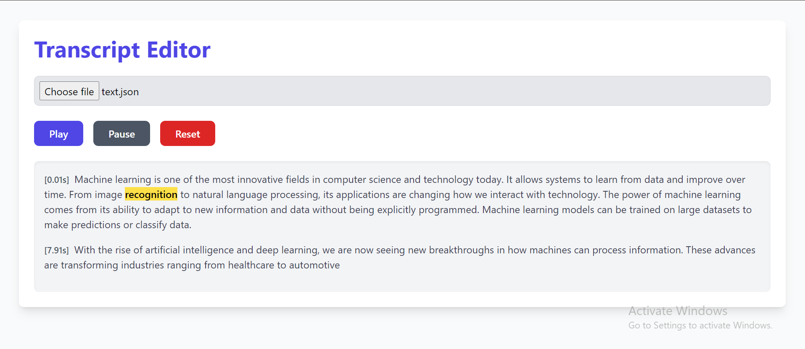

# Transcript Editor

A React application that allows users to upload a transcript in JSON format, play it back with word-by-word highlighting based on timing, and edit individual words in the transcript. 

## Features

- *Upload Transcript:* Load a JSON file containing a transcript with text and timing data.
- *Playback:* Highlight words based on their timing, with play, pause, and reset functionalities.
- *Editing:* Edit individual words in the transcript, with automatic reversion to the original text if deleted.
- *Dynamic Highlighting:* Words are highlighted in real-time as they are played back.

 

## Getting Started

### Prerequisites

Ensure you have Node.js and npm installed on your machine. You can download them from [Node.js official website](https://nodejs.org/).

### Installation

1. *Clone the repository:*
   ```bash
   git clone https://github.com/yourusername/transcript-editor.git
   cd transcript-editor

2. *Install dependencies:*
   ```bash
   npm install

3. *Start server:*
   ```bash
   npm run dev
 

